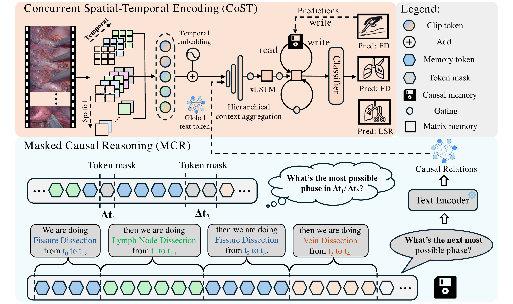

# LungRes80: Towards Tangled Surgical Workflow Recognition in Video-Assisted Thoracoscopic Surgery

## Overview

Video-assisted thoracoscopic surgery (VATS) is a minimally invasive procedure for removing specific lung segments in the treatment of early-stage lung diseases. Its workflow involves intricate vascular and bronchial anatomy, making reliable phase recognition particularly challenging.

LungRes80 contains 269,806 phase-annotated frames sampled from 80 VATS procedures. The dataset captures diverse short-term transitions between surgical phases as well as long-term causal relationships throughout the procedure.

LungReco is an online surgical phase recognition model developed for LungRes80. It combines Concurrent Spatial-Temporal encoding (CoST) with Masked Causal Reasoning (MCR) to reason over continuously updated visual and semantic memories. The repository also provides the Attentional Distraction Coefficient (ADC), a metric designed to quantify the cost of incorrect predictions and subsequent corrections.

## Main Figure



## Installation

Create the Conda environment and install the additional dependencies:

```bash
conda env create -f environment.yml
conda activate LungReco
pip install -r requirements_lungreco.txt
```

The following resources are required:

- the LungRes80 dataset;
- the Kinetics-400 pretrained `TimeSformer_divST_8x32_224_K400.pyth` checkpoint;
- LLaVA v1.5 7B, referenced by default as `liuhaotian/llava-v1.5-7b`.

## Data Preparation

Organize the extracted frames and phase annotations as follows:

```text
LungRes80/
├── frames/
│   ├── 01/
│   ├── 02/
│   └── ...
└── phase_annotations/
    ├── 01.txt
    ├── 02.txt
    └── ...
```

Generate the training, validation, and test pickle files:

```bash
python tools/rebuild_lungres80_splits.py /path/to/LungRes80
```

The split contains 50 training videos, 15 validation videos, and 15 test videos. The generated files are written to:

```text
LungRes80/labels/train/1fpstrain.pickle
LungRes80/labels/val/1fpsval.pickle
LungRes80/labels/test/1fpstest.pickle
```

## Training and Testing

Run the complete training and online evaluation workflow with:

```bash
PROJECT_ROOT=$PWD \
DATA_ROOT=/path/to/LungRes80 \
PRETRAINED_PATH=/path/to/TimeSformer_divST_8x32_224_K400.pyth \
LLAVA_MODEL_PATH=liuhaotian/llava-v1.5-7b \
TORCHRUN_BIN=$(command -v torchrun) \
RUN_NAME=lungreco_run1 \
bash scripts/train_lungres80.sh
```

The default configuration uses two GPUs, a batch size of 8 per GPU, BF16, and DeepSpeed. Model selection is performed on the validation set, and the selected checkpoint is evaluated online on the test set.

Online validation and testing process each video in chronological order. Temporal state is reset at the beginning of every video, and predictions use only the current and preceding frames.

## Evaluation

Online inference produces the following files:

```text
unrelaxed.jsonl
metrics_strict.json
metrics_relaxed_k5.json
```

`unrelaxed.jsonl` stores per-frame logits, raw predictions, raw probabilities, and smoothed probabilities. Strict and relaxed metrics are calculated from the same saved predictions.

Metrics can also be calculated separately:

```bash
python evaluation_lungreco.py /path/to/unrelaxed.jsonl
python evaluation_lungreco.py /path/to/unrelaxed.jsonl --relaxed --relax-k 5
```

The evaluation includes Accuracy, Precision, Recall, Jaccard, ADC, segmental Edit, and F1@10/25/50.

## License

See [LICENSE](LICENSE) for licensing information.

## Citation

If you find this work useful, please cite:

```bibtex
@article{guo2026lungres80,
  title={LungRes80: Towards tangled surgical workflow recognition in video-assisted thoracoscopic surgery},
  author={Guo, Diandian and Yang, Shu and Pei, Jialun and Li, Jiaao and Wan, Yanhui and Chen, Hao and Heng, Pheng-Ann},
  journal={Medical Image Analysis},
  pages={104237},
  year={2026},
  publisher={Elsevier}
}
```
